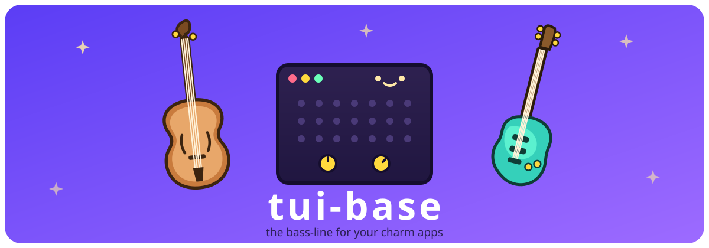

# tui-base



[](https://github.com/jarvisfriends/tui-base/actions/workflows/ci.yml)
[](https://www.bestpractices.dev/projects/13787)
[](https://scorecard.dev/viewer/?uri=github.com/jarvisfriends/tui-base)
[](https://pkg.go.dev/github.com/jarvisfriends/tui-base)

A structured, production-minded foundation for building large Charm v2 terminal applications in Go.

This project is designed for engineers who want more than a demo app: predictable architecture,
consistent theme behavior, keyboard and mouse interaction patterns, and debug tooling that helps
you understand message flow while you build.

[](https://coveralls.io/github/jarvisfriends/tui-base?branch=main)

## Sibling repos

- [jarvisfriends/snap](https://github.com/jarvisfriends/snap) — "Jarvis Friends
  Snap": reusable Charm v2 components used by tui-base, including navigation,
  status, notifications, pickers, table, styles, key bindings, geometry, and
  date/time controls.
- [jarvisfriends/inspector](https://github.com/jarvisfriends/inspector) — the
  runtime debugger used for the Ctrl+D overlay and available to any Charm app.

## Why This Exists

Building a large TUI gets hard when app state, routing, styling, and diagnostics are scattered.
`tui-base` provides an opinionated structure that keeps those concerns coherent:

- Router-first composition for multi-page apps.
- Shared live theme pointer propagated across components.
- Status and notification primitives for global UX.
- Inspector workflows for observing runtime behavior.
- Test- and benchmark-friendly package boundaries.

## Current Capabilities

The following milestone capabilities are already implemented:

- Shared style propagation via one mutable app style pointer.
- Window title + terminal canvas foreground/background managed at router and page level.
- Keyboard + mouse navigation via Sidebar and Tabs.
- Global shortcuts for settings, navigation visibility, detailed help, and status visibility.
- Runtime navigation style switching and settings persistence.
- Settings UX with overview rows + overlay editor forms.
- Live theme preview while editing settings.
- Runtime logging configuration and level updates.
- Inspector message log with deduplication and runtime log streaming.
- Notification manager with severity, TTL, persistence, keyed action items, and history panel.
- Status bar integrations for settings and notification controls, including pending-action counts.
- Compositor-based overlays for toast/history rendering plus router-registered action prompts.
- Modern Go cleanup workflow using `modernize -fix`.

## Project Layout

- `tuibase.go`: root consumer package — `tuibase.Run(tuibase.Options{...})` bootstraps a full app.
- `main.go` (root): runnable reference application; `cmd/tui-base/` keeps its demo tapes.
- `router/`: root model and message routing.
- `pages/`: page models (`home`, `settings`); the Ctrl+D inspector now
  comes from [inspector](https://github.com/jarvisfriends/inspector).
- `theme/`: compatibility alias shim over `snap/styles`.
- `logging/`: runtime logger + subscriber fanout.
- the reusable components (navigation, status bar, notifications, table,
  styles, pickers, key bindings, geometry, date/time pickers, gates, winterm)
  come from [snap](https://github.com/jarvisfriends/snap).
- `common/`: shared public interfaces/types.

## Quick Start

For a practical walkthrough, see [docs/getting-started.md](docs/getting-started.md).

## Demos

The snap components that need a router+pages host — navigation, status bar,
notifications — are demoed here, in the reference app (their tapes can't live
in a synthetic snap example). Gifs are build artifacts, not committed
sources: the release workflow renders every `*.tape` and attaches the gifs to
the tag, so the gallery below points at fixed
`releases/latest/download/<name>.gif` URLs. Render locally with
`go -C tools/rendertapes run .` (Docker or Podman; the tool cross-compiles
the demo binaries, runs each tape in the official vhs container, and drops
the gifs in `dist/`).

Every app below also ships as its own signed, per-OS/arch prebuilt binary on
the [Releases page](https://github.com/jarvisfriends/tui-base/releases) — no
Go toolchain required to try one. See
[`examples/USAGE.md`](examples/USAGE.md) for what each app demos.

### Reference app tour


Pages, the settings overlay editor, and the Ctrl+D inspector.

### Navigation


The multipage example cycling pages with Tab, focusing the sidebar with
Ctrl+B for live arrow-key switching, and hiding/showing the nav chrome.

### Notifications + status bar


Info/warning/error toasts fired from the inspector's test keys, TTL expiry,
the status bar's notification count, full help, and hiding/showing the bar.

## Architectural Notes

For durable design rationale and decisions, see [docs/architecture-decisions.md](docs/architecture-decisions.md).

## Roadmap

The roadmap now tracks only open work. See [.github/ROADMAP.md](.github/ROADMAP.md).

## Local Development

### Prerequisites

Install these once to match the full CI gate locally:

```bash
# Go (1.26.5+; 1.26.4 has a known CVE) - https://go.dev/dl/

# golangci-lint
curl -sSfL https://raw.githubusercontent.com/golangci/golangci-lint/master/install.sh | sh -s -- -b $(go env GOPATH)/bin

# shellcheck
brew install shellcheck          # macOS/Linux via Homebrew
# or: apt-get install shellcheck

# markdownlint-cli2
npm install -g markdownlint-cli2

# actionlint
brew install actionlint          # macOS/Linux
# or: go install github.com/rhysd/actionlint/cmd/actionlint@latest

# govulncheck
go install golang.org/x/vuln/cmd/govulncheck@latest
```

- Build baseline:
  - `go build ./...`
- Run tests:
  - `go test ./... -v`
- Run race tests:
  - `go test -race ./... -v`
- Run lint:
  - `GOOS=windows GOARCH=amd64 golangci-lint run ./...`
  - `GOOS=linux GOARCH=amd64 golangci-lint run ./...`
- Run full local verification (hook-equivalent):
  - `bash tools/local_verify.sh`
